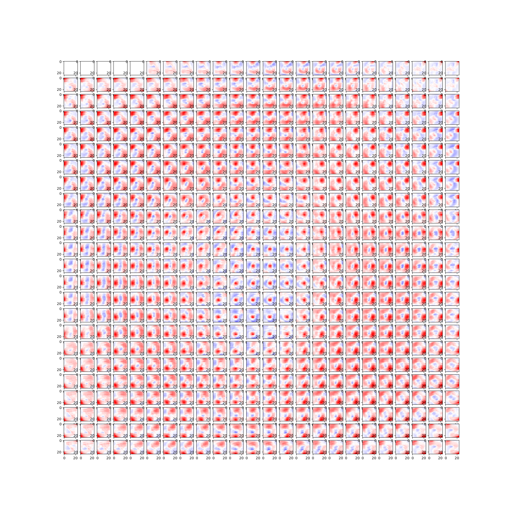
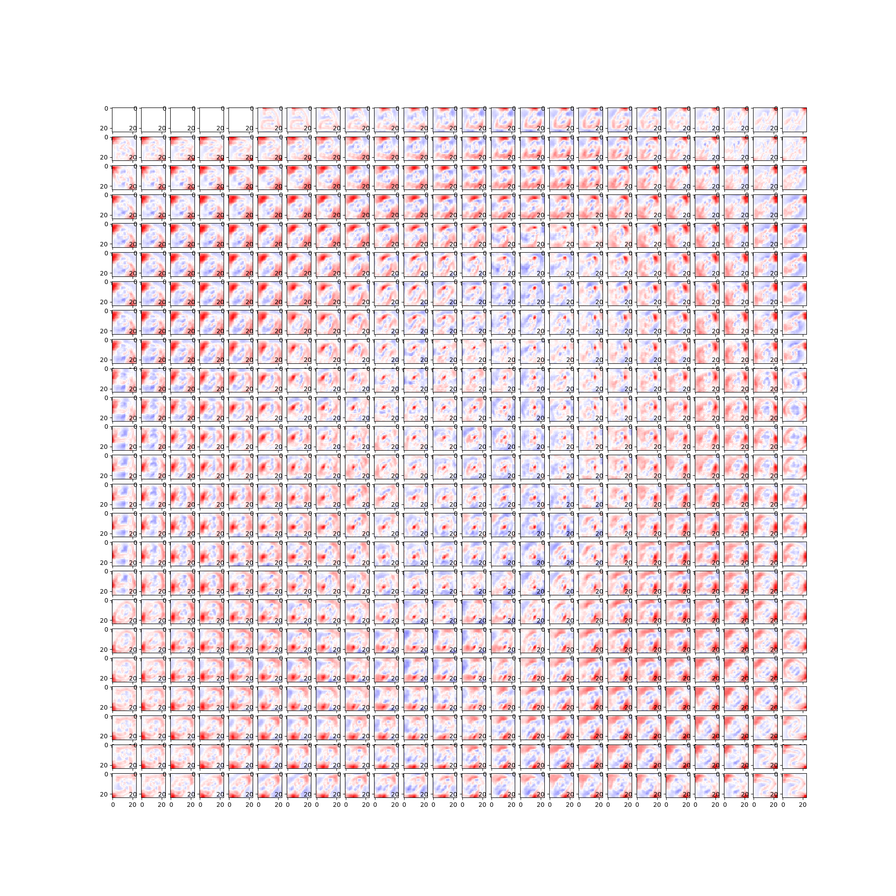

# 卒業研究で使用したプログラム
卒業研究で用いた、転移学習と共適応とドロップアウトの３者の関係性を調査するためのプログラムです。
この関係性を調べるために、ネットワークの中間層出力値の相関行列などを計算しています。
2系のPythonで、機械学習系ライブラリのChainerを使っています。

### コード概要
1. create_mnist_dataフォルダ
 * extract_mnist_pic.py : chainer mnistからmnistの画像をダウンロードし、クラスごとに保存する
 * change_mnist.py : mnist画像にノイズを加える
 
2. mnistTL_Sourceフォルダ
 * my_mnistTL_Source.py : 転移学習のベースとなるネットワークの作成

3. mnistTL_Targetフォルダ
 * my_mnistTL_Target.py : ベースのネットワークの情報を使った転移学習により、ネットワークを作成する
 * mnist_load_initial.py : ベースのネットワークから情報を受け取るために、my_mnistTL_Target.pyで使用するメソッドのコード
 
4. output_corrcoefフォルダ
 * caluc_hidden_cov_corrcoef.py : 学習済みネットワークの中間層の共分散行列と相関行列を可視化する
 * caluc_hidden_cov_eigv.py : 学習済みネットワークの共分散行列の固有値を算出する

### 出力結果の例
相関行列のヒートマップ
 * 赤：正の相関, 青：負の相関　
 * 色が濃いほど相関関係が強い
 
<table>
  <tr>
    <th>ドロップアウト率=0</th>
    <th>ドロップアウト率=0.5</th>
  </tr>
  <tr>
    <td></td>
    <td></td>
  </tr>
</table>
